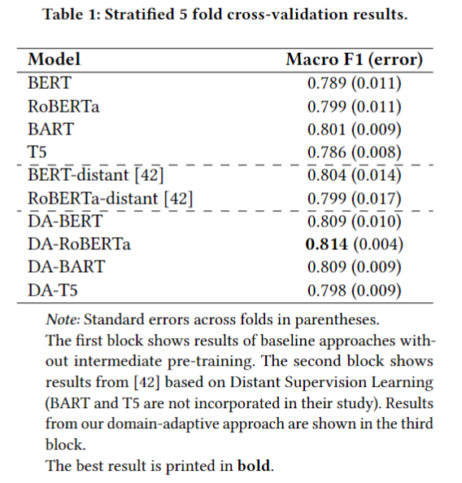

# A-Domain-adaptive-Pre-training-Approach-for-Language-Bias-Detection-in-News
The repository contains the data files and scripts corresponding to the paper "A Domain-adaptive Pre-training Approach for Language Bias Detection in News".

# Introduction
Media bias is a multi-faceted construct influencing individual behavior and collective
decision-making. Slanted news reporting is the result of one-sided and polarized writing which can occur in various forms. In this work, we focus on an important form of media bias, i.e. \textit{bias by word choice}. Detecting biased word choices is a challenging task due to its linguistic complexity and the lack of representative gold-standard corpora. We present DA-RoBERTa, a new state-of-the-art transformer-based model adapted to the media bias domain which identifies sentence-level bias with an F1 score of 0.814. In addition, we also train, DA-BERT and DA-BART, two more transformer models adapted to the bias domain. Our proposed domain-adapted models outperform prior bias detection approaches on the same data. 

# Experiments resulting in models contained in this repo

## Pre-training on the *WikiNeutralityCorpus* (Pryzant et al., 2020)
- supervised binary sequence classification task
- initialization of RoBERTa, BERT, BART, and T5
with pre-trained weights provided by the HuggingFace API + dropout layer (Dropout = 0.2) and randomly initialized linear
transformation layer (768,2) 
- batch size = 32
- AdamW optimizer
- Learning rate = 1𝑒−5
- Binary Cross-Entropy Loss

## Fine-tuning on BABE corpus containing biased and non-biased sentences extracted from news articles (Spinde et al., 2021)
- same bs, optimizer, and learning rate as during pre-training
- performance evaluation on BABE via 5 fold cross validation and F1 score

## Baseline
- for every domain-adaptive language model, we
compare its sentence classification performance on BABE to the
same architecture merely fine-tuned on BABE (without domain-
adaptive pre-training as an intermediate training step)
- we additionally compare our models to a prior apprach by Spinde et al. (2021) using Distant Supervision on news headlines as pre-training approach.

## Results

Below table shows the F1 scores (averaged over 5-fold CV split) of our transformer-based experiments on the binary sentence classification task. 
All domain-adapted models (third block) outperform the baselines models (first block) and the distantly supervised models (middle block) trained by Spinde et al. (2021) via Distant Supervision.




# Files contained in this repo

All models can be found anonymously on: https://drive.google.com/drive/u/4/folders/1-A1hGKeu-27X9I4ySkja5vMlVscnF8GR. You can also download our best performing model via HuggingFace (https://huggingface.co/Datadave09/DA-RoBERTa).
- "DA-Roberta.bin": Domain-adaptive Pre-training with RoBERTa.
- "DA-T5.bin": Domain-adaptive Pre-training with T5.
- "DA-BERT.bin": Domain-adaptive Pre-training with BERT.
- "DA-BART.bin": Domain-adaptive Pre-training with BART.
- "classifier.weights.pt" and "classifier.bias.pt": Parameters for classification layer + bias used for all models prior to Domain-adaptive Pre-training to achieve maximum comparability between approaches.

# Description of files
- "BABE.xlsx": BABE corpus provided by Spinde et al. (2021): https://github.com/Media-Bias-Group/Neural-Media-Bias-Detection-Using-Distant-Supervision-With-BABE
- "domain-adaptive-pretraining.ipynb": Domain-adaptive Pre-training script (More information provided in the script's header)
- "fine-tune-and-evaluate-domain-adaptive-pretraining.ipynb": Script to fine-tune Domain-adapted models on BABE corpus via 5-fold CV.

# How to use

You can use the model with the Pytorch framework as shown in the following lines of code:

```
#imports
!pip install transformers
!pip install openpyxl
import torch
import torch.nn as nn
import numpy as np
from transformers import RobertaTokenizer,RobertaModel

#define model class including binary classification layer 
class RobertaClass(torch.nn.Module):
    def __init__(self):
        super(RobertaClass, self).__init__()
        self.roberta = RobertaModel.from_pretrained("roberta-base")
        self.vocab_transform = torch.nn.Linear(768, 768)
        self.dropout = torch.nn.Dropout(0.2)
        self.classifier1 = torch.nn.Linear(768,2)

    def forward(self, input_ids, attention_mask):
        output_1 = self.roberta(input_ids=input_ids, attention_mask=attention_mask)
        hidden_state = output_1[0]
        pooler = hidden_state[:, 0]
        pooler = self.vocab_transform(pooler)
        pooler = self.dropout(pooler)
        output = self.classifier1(pooler)

        return output

#load model parameters
weight_dict = torch.load('Roberta_full.bin')
                         
#initialize model with fine-tuned parameters
model = RobertaClass()
model.load_state_dict(weight_dict)

#exemplary bias classification with instance extracted from BABE dataset (Spinde et al.,2021)
tokenizer = RobertaTokenizer.from_pretrained('roberta-base')
inputs = tokenizer("A cop shoots a Black man, and a police union flexes its muscle", return_tensors="pt")
outputs = model(**inputs)

if int(torch.argmax(outputs)) == 1:
    print("Biased")
else:
    print("Non-biased")
```

# Cite as

```
@InProceedings{Krieger2022,
  author={Krieger, David and Spinde, Timo and Ruas, Terry and Kulshrestha, Juhi and Gipp, Bela},
  booktitle={2022 ACM/IEEE Joint Conference on Digital Libraries (JCDL)}, 
  title={{A} {D}omain-adaptive {P}re-training {A}pproach for {L}anguage {B}ias {D}etection in {N}ews}, 
  year={2022},
  month        = {June},
  location = {Cologne,Germany}
  topic        = {newsanalysis}
  }
  ```
  
  More about our work can be found here: https://media-bias-research.org/


